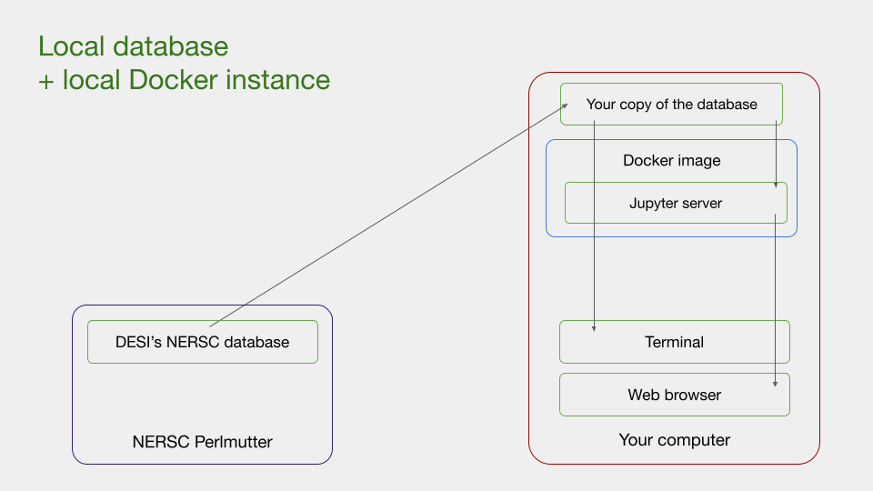

# Integrated Docker environment for accessing cloud- and locally-hosted DESI data

_Xing Liu (UC Berkeley) and Anthony Kremin (Berkeley Lab), April 2024_

DESI's early data release (EDR) is available to the public, free of charge, 
at the **desidata** S3 cloud storage "bucket" on Amazon Web Services (AWS).

Here, we provide a Docker image which makes it easy to work with both local and cloud-hosted DESI data.
Our Docker image is a self-contained Linux environment which comes pre-packaged with
* A Jupyter server installed with general Python libraries for scientific programming, as well as DESI-specific libraries, and
* A filesystem mounted to the DESI S3 bucket, which automatically downloads the data you query and nothing more.

Most DESI code developed for NERSC can run on this Docker image with little to no modifications.

 \
*You are free to choose a combination of local/cloud-hosted databases and local/cloud-hosted programming environments to suit your workflow.*

If your DESI data is hosted locally, or if you want to stream the S3 DESI data to process locally,
then please follow the instructions at [Running the Docker image locally](#running-the-docker-image-locally).
We emphasize that local data processing is only practical for those with high-performance computers.
Due to the high resolution of DESI data, you should only run the image locally if your computer has at least 16 GB of memory (24 GB recommended).

Otherwise, we recommend running the Docker image at your institution's computing center,
or a commercial cloud computing center such as AWS Elastic Cloud Compute (EC2).
A cloud compute instance gives you on-demand access to additional storage and processing power.
AWS EC2, in particular, have a very high-bandwidth internal network integration with AWS S3.
If you are interested, then please follow the instructions for 
[Running the Docker image on an AWS EC2 cloud compute instance](#running-the-docker-image-on-aws-ec2).

## Running the Docker image locally

### System requirements

* A modern version of Windows, macOS, or Linux
  * Windows users need to first install [Windows Subsystem for Linux (WSL)](https://learn.microsoft.com/en-us/windows/wsl/install)
    and [Windows Terminal](https://learn.microsoft.com/en-us/windows/terminal/install).
    Then, in Windows Terminal, switch from PowerShell to a Linux shell (such as Ubuntu).
* At least 16 GB of memory (24 GB recommended)
* At least 32 GB of free storage if streaming data from S3 (64 GB recommended); A lot more if locally hosting data

### Step 1. Installing Docker

We will be using Docker Engine, Docker's command-line tool.
* Windows and macOS users should install [Docker Desktop](https://docs.docker.com/get-docker/), which comes bundled with Docker Engine.
* Linux users can either install the full [Docker Desktop](https://docs.docker.com/get-docker/), or [Docker Engine for Linux](https://docs.docker.com/engine/install/) directly.

### Step 2. Running the image

Open your computer terminal, and navigate to the folder you use as your workspace for DESI.

If your DESI data is locally hosted at `local_data_path`, then enter this command:
```bash
docker run -it -p 8888:8888 -e DESI_RELEASE=edr \
  --volume "$(pwd):/home/synced" \
  --volume "local_data_path:/home/desidata:ro" \
  ghcr.io/desihub/desidocker:main
```
* If you want to give the Docker container write access to your data release, then remove the `:ro` at the end of the flag.

Otherwise, to access the DESI data hosted at AWS S3, then enter this command instead:
```bash
docker run -it -p 8888:8888 -e DESI_RELEASE=edr \
  --volume "$(pwd):/home/synced" \
  --cap-add SYS_ADMIN --device /dev/fuse --security-opt apparmor:unconfined \
  ghcr.io/desihub/desidocker:main
```
 * Note that mounting the S3 bucket as a local filesystem [requires](https://docs.docker.com/engine/reference/run/#runtime-privilege-and-linux-capabilities)
   granting the container sysadmin-level access to your computer's [FUSE](https://en.wikipedia.org/wiki/Filesystem_in_Userspace) interface.
   This is not ideal for security, so if that is a major concern, then we do recommend running a cloud instance.

Once the image starts running, locate the line beginning with `http://127.0.0.1:8888/lab?token=...` in the output, and open the address in your browser.


## Running the Docker image on AWS EC2

### Step 1. Creating an account

While you do not need an AWS account to access the DESI data locally,
you do have to make one in order to use the AWS EC2 service.
Follow the official instructions for
[First time users of AWS](https://docs.aws.amazon.com/accounts/latest/reference/welcome-first-time-user.html)
to get started.
Once you’ve signed into your account, 
we recommend switching your region to **us-west-2 (Oregon)** as that is the region of our S3 bucket.
Then, you can navigate to **Services » EC2** to set-up a cloud compute instance.

### Step 2. Creating a security group

To access the Jupyter web server provided by our Docker image, 
first we need to create a security group which allows HTTPS network access.

Navigate to **Services » EC2 » Security groups**, then click **Create security group**.
Fill in the following fields &mdash;

1. **Basic details:** Name the security group **jupyter**.
2. **Inbound rules:** Add the following rules &mdash;

| Type       | Protocol | Port range | Source type | Source      | Description
| ----       | -------- | ---------- | ----------- | ------      | -----------
| Custom TCP | _(TCP)_  | 8888       | My IP       | _(Your IP)_ | Open TCP port for Jupyter server
| HTTPS      | _(TCP)_  | _(443)_    | My IP       | _(Your IP)_ | Allow HTTPS for Jupyter server
| SSH        | _(TCP)_  | _(22)_     | My IP       | _(Your IP)_ | Allow SSH access to the instance

* If your IP address is not fixed (for example, if you primarily use cellular data or are on a large WiFi network),
  you should instead enter "Custom" for **Source type** and the range of possible IP addresses you use in **Source**.


3. **Outbound rules:** Add the following rule (if it isn't already there) &mdash;

| Type        | Protocol | Port range | Source type   | Source        | Description
| ----        | -------- | ---------- | -----------   | ------        | -----------
| All traffic | _(All)_  | _(All)_    | Anywhere-IPv4 | _(0.0.0.0/0)_ | Allow instance to access the whole internet

Then click **Create security group**.

### Step 3. Launching an instance

Navigate to **Services » EC2 » Instances**, then click **Launch instances**.
Fill in the following fields &mdash;

1. **Name and tags:** Pick your own.
2. **Application and OS Images (Amazon Machine Image):** We recommend selecting **Amazon Linux**, although Ubuntu and other Linux distributions should also work.
3. **Instance type:** We recommend starting with **t2.xlarge** or **t2.2xlarge**, due to the memory-intensive nature of processing DESI data.
   You should upgrade to other instances if you need more processing power and memory.
5. **Key pair:** Create your own and save the private key file.
6. **Network settings:** Select the **jupyter** security group we created earlier.
7. **Configure storage:** For free-tier accounts, we recommend the maximum available **30 GiB**. There can be a lot of locally cached DESI data!

Then click **Launch instance**.
After the instance has loaded, follow the official instructions to 
[Connect to your instance](https://docs.aws.amazon.com/AWSEC2/latest/UserGuide/ec2-instance-connect-methods.html).

### Step 4. Installing Docker on the instance

Run the following lines to install Git and Docker on Amazon Linux, which uses the `yum` package management system.
```bash
# Install Git and Docker
sudo yum update
sudo yum install git
sudo yum install docker
```
```bash
# Give Docker extra permissions
sudo usermod -a -G docker ec2-user
id ec2-user
newgrp docker
sudo systemctl enable docker.service
```
If you are using a different Linux distribution on your instance, 
refer to the official instructions to install [Docker Engine for Linux](https://docs.docker.com/engine/install/) instead.

### Step 5. Running the image

Run this command to start Docker,
```bash
sudo systemctl start docker.service
```
then, run this command to find your public IP address. Save this address somewhere.
```bash
curl http://checkip.amazonaws.com
```
* These commands need to be re-run every time you start your instance.

Finally, run this shell command to download and run the image.
```bash
docker run -it -p 8888:8888 -e DESI_RELEASE=edr \
  --volume "$(pwd):/home/synced" \
  --cap-add SYS_ADMIN --device /dev/fuse --security-opt apparmor:unconfined \
  ghcr.io/desihub/desidocker:main
```
* If you encounter an `unknown server OS` error, you may need to restart Docker.

Once the image starts running, locate the line beginning with `http://127.0.0.1:8888/lab?token=...` in the output.
Replace `127.0.0.1` with the public IP address of your cloud server, then open the modified link in your browser.

## Customizations

* To point `$DESI_ROOT` to another public data release, 
  replace `edr` with the other release's name in the `-e DESI_RELEASE=edr` flag.
* The internal and external ports of the Jupyter server are respectively the first and second `8888` in `-p 8888:8888`.
  Adjust the external port (as well as the port security policy if using EC2) should you encounter port collision issues.
* To sync your changes in the container to a custom local folder, 
  replace `$(pwd)` (which points to the folder where you entered the `docker run` command) 
  with the absolute path to the custom folder in the `--volume "$(pwd):/home/synced"` flag.
* To build the image from source (requires some patience), enter the command
```bash
docker build github.com/desihub/desidocker.git --tag desi-docker
```
  Then, replace the tag `ghcr.io/desihub/desidocker:main` with `desi-docker` when running the image.
  

## Updating the Docker image

To update your Docker image, run
```bash
docker pull ghcr.io/desihub/desidocker:main
```
